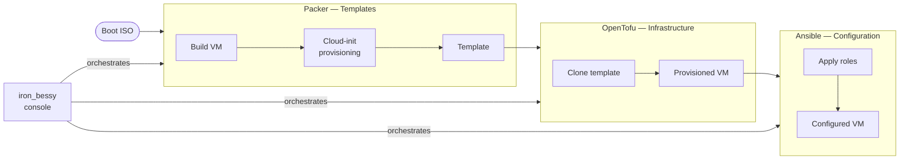

# iron_bessy

IaC pipeline for building, provisioning, and configuring virtual machines on Proxmox. Orchestrated through an interactive console that guides each stage from raw ISO to a fully configured, policy-checked server.

## Concepts

**Each stage is independent but feeds the next.** Packer produces a Proxmox VM template; OpenTofu clones it into running infrastructure; Ansible configures what's running. The console drives all three from a single menu without requiring the operator to manage credentials or remember arguments between runs.

**Dynamic values.** Every value which can be dynamic, is. This is critical for ensuring that values are paramatized and actually passed from one pipeline component to the next, not just hard-coded the same in both.

That said, to make usage a little easier, the console does cache most build parameters (node selections, storage pools, network bridges, VLANs, etc) in a local `console.cache` file scoped by cluster.

**Minimal manual intervention.** The Console should be able take care of any predictable work not related to editing the core configurations for Packer (.pkr.hcl), Tofu (.tf), or Ansible (roles). It handles all the ansillary work like setting up service accounts, managing orchistration-level variables, updating inventories and manifests, etc.

**Minimize credential exposure.**
Proxmox API credentials live only in `credentials.conf` and are injected as environment variables, they never touch the command line, get written into build artifacts, or are present in stout or sterr.

**The pipeline manifest is the handoff between stages.** After a successful Packer build, `console/pipeline/templates.json` is updated with the template's VMID and name. OpenTofu reads this file to know what to clone, so there is no hard-coded ID to keep in sync. OpenTofu in turn writes an inventory of all built VMs for consumption by Ansible, minimizing errors and overhead in keeping inventory files up to date.



## Repository Layout

```
iron_bessy/
├── packer/       # VM template build configs and cloud-init
├── console/      # Interactive pipeline console (iron_bessy.sh)
│   └── pipeline/ # Build artifact manifests consumed by downstream stages
└── opentofu/     # OpenTofu infrastructure configs
```

See [packer/README.md](packer/README.md), [console/README.md](console/README.md), and [opentofu/README.md](opentofu/README.md) for documentation.

## Quick Start

### Prerequisites

**Local tools:**
- bash 4.0+, curl, jq
- [Packer](https://developer.hashicorp.com/packer/install) (HashiCorp)
- [OpenTofu](https://opentofu.org/docs/intro/install/)
- ISO build tools: xorriso + mkisofs (Linux), hdiutil (macOS), or oscdimg (Windows ADK)

**Proxmox:**
- At least one node, standalone or clustered
- Ubuntu 24.04 LTS Server ISO uploaded to an ISO storage pool
- A VM storage pool with at least 30 GB free per template
- A short-lived admin API token for bootstrapping (e.g. `root@pam!setup`) — used once during Setup, never stored on disk

### One-time configuration

Two files need to be edited before running the console for the first time:

**1. Packer image credentials** — the username and password written into the VM template by cloud-init:
```bash
cp packer/ubuntu-server-2404-core/global_secrets.pkrvars.hcl.example \
   packer/ubuntu-server-2404-core/global_secrets.pkrvars.hcl
# Edit: set template_username and template_password
```

**2. OpenTofu VM definitions** — what VMs to provision and how:
```bash
mkdir -p opentofu/clusters/<your-cluster-name>
# Create opentofu/clusters/<cluster>/<group>.tfvars
# See opentofu/clusters/tmm01/dshield.tfvars for an example
```

### First run

```bash
./console/iron_bessy.sh
```

On first run, go through Setup before anything else. Setup uses the bootstrap admin token to create dedicated, least-privilege service accounts for Packer and OpenTofu, and writes their credentials automatically to `console/credentials.conf`:

```
iron_bessy
  → Setup
      → Packer service account       # creates packer@pve + API token
      → OpenTofu service account     # creates terraform@pve + API token
```

Once Setup is complete, the full pipeline is available:

```
iron_bessy
  → Build a VM template         # runs Packer, writes pipeline/templates.json
  → Provision infrastructure    # select cluster + group, runs tofu apply
```

Subsequent runs skip all prompts that have cached answers. Pass `--no-cache` to re-prompt everything.

## Roadmap

### Step 1 — Packer + Console (Ubuntu) `complete`

Interactive console wrapping Packer to build Ubuntu 24.04 Server templates on Proxmox. Handles dynamic resource discovery, cluster-scoped config caching, VMID conflict resolution, and pipeline manifest output.

### Step 2 — OpenTofu (Ubuntu) `complete`

Provision VMs by cloning the Packer-built Ubuntu template. VMID sourced from `pipeline/templates.json`. Console extended with a new pipeline stage to drive the apply, per-cluster workspaces and inventory output, cluster-scoped network defaults, optional SSH-key provisioning, and cluster-level firewall security groups.

### Step 3 — Ansible (Ubuntu) `in progress`

Post-provision configuration via Ansible roles. Console stage to trigger playbook runs against newly provisioned hosts.

### Step 4 — Windows Server 2025 `todo`

Extend the full pipeline (Packer → OpenTofu → Ansible) for Windows Server 2025. Separate image config, WinRM communicator, and Windows-specific Ansible roles.

### Step 5 — Security as Code `todo`

- **Packer:** Integrate Trivy/Grype image scanning. Fail the build on findings above threshold.
- **OpenTofu:** Add tfsec/Checkov to pre-commit hooks. Block applies with policy violations.
- **OPA:** One custom Rego policy enforcing environment-specific constraints across the pipeline.
- **Ansible:** CIS hardening via [ansible-lockdown](https://github.com/ansible-lockdown).

### Step ? - Use VSCode Dev Container

For easy portability, use a local docker container as the runtime. Handles all dependencies cleanly, particularly useful for Windows machines.

## License
Licensed under GPLv3, see LICENSE.