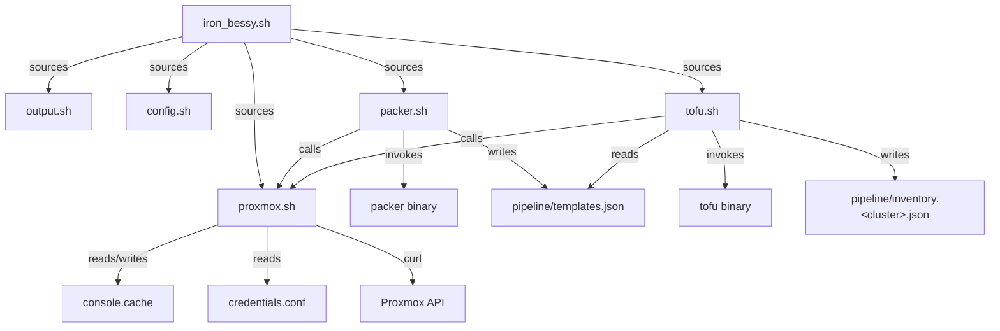
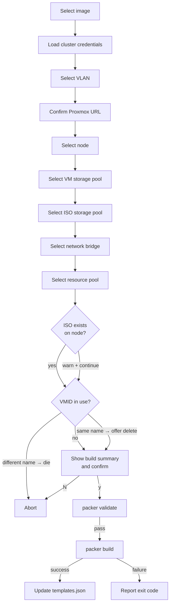
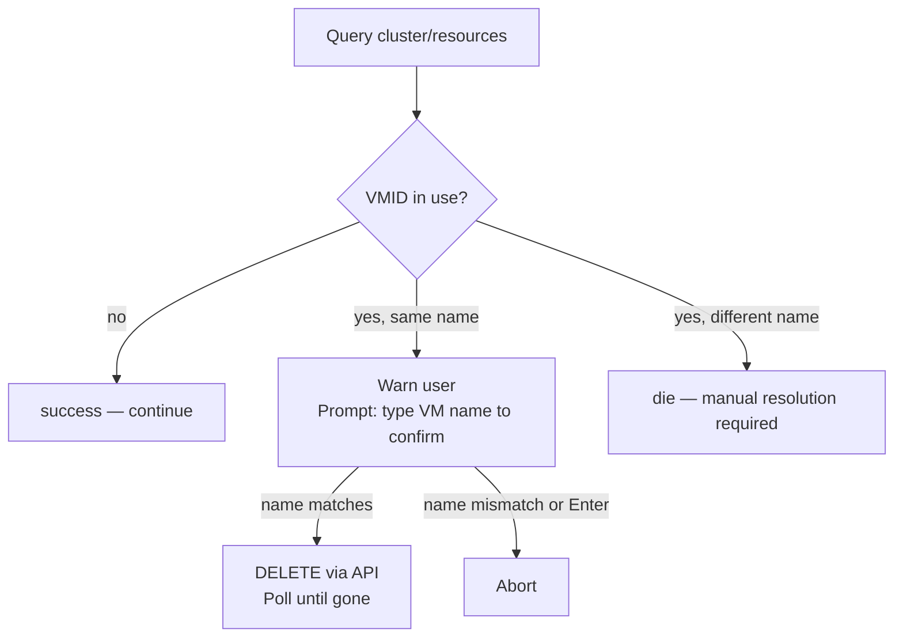

# iron_bessy Console

Interactive pipeline console (referred to elsewhere in this repo as just *the console*) for building Proxmox VM templates with Packer and provisioning VMs from those templates with OpenTofu. Handles credential management, dynamic resource discovery, cluster-scoped configuration caching, workspace selection, and build/apply orchestration through a menu-driven interface.

## Quick Start

```bash
# First run
cp console/credentials.conf.example console/credentials.conf
# Edit credentials.conf with your Proxmox API token(s)

./console/iron_bessy.sh
```

On subsequent runs, all prior selections (node, storage pools, bridges, etc.) are restored automatically. Pass `--no-cache` to re-prompt for everything.

## Directory Structure

```
console/
├── iron_bessy.sh              # Entrypoint and main menu
├── credentials.conf.example       # Example for Proxmox API credentials
├── console.cache.example            # Example of the generated config cache
├── shared/
│   ├── output.sh              # Logging, color, and prompt helpers
│   ├── config.sh              # Cluster-scoped configuration cache
│   ├── proxmox.sh             # Proxmox API helpers and selectors
│   ├── packer.sh              # Packer workflow and build orchestration
│   └── tofu.sh                # OpenTofu workflow and provisioning orchestration
└── pipeline/
    ├── templates.json         # Packer build manifest (updated after each build)
    └── inventory.<cluster>.json  # OpenTofu VM inventory per cluster (updated after each apply/destroy)
```

`credentials.conf` and `console.cache` are gitignored.

## Architecture



## Usage

```
./console/iron_bessy.sh [--no-cache]
```

| Flag | Effect |
|---|---|
| *(none)* | Restore all cached values; prompt only for what is unset |
| `--no-cache` | Prompt for every input; cached values are shown as defaults |

## Build Workflow

Running "Build a VM template" walks through these steps in order:



Each step caches its result to `console.cache` so it is skipped on the next run unless `--no-cache` is passed or the cached value is no longer valid (e.g., a storage pool was removed from the node).

## Configuration Cache (`console.cache`)

The cache file uses an INI format scoped by cluster. This means two clusters can have different nodes, storage pools, bridges, and VLANs without colliding.

Bridge and VLAN are keyed per image (`VM_NETWORK_BRIDGE_<image>`, `VM_NETWORK_VLAN_<image>`) because different templates may live on different VLANs.

`PROXMOX_CLUSTER` is stored outside any section so it is readable before a cluster is selected — it is used only to hint "last used" in the menu.

## Credentials (`credentials.conf`)

Proxmox API credentials for one or more clusters, in INI format.

Section headers are cluster names shown in the selection menu. They are arbitrary labels, they don't have to match the actual cluster name (for flexibility when maintaining multiple environments). If only one cluster is defined, it is selected automatically.

Each tool has its own credential keys in `credentials.conf`. Packer credentials (`packer_username`, `packer_token`) are loaded into `PKR_VAR_proxmox_username` and `PKR_VAR_proxmox_token`. OpenTofu credentials (`tofu_username`, `tofu_token`) are loaded into `TF_VAR_proxmox_username` and `TF_VAR_proxmox_token` by `_tofu_load_credentials` in `tofu.sh`. Credentials are never written to disk beyond `credentials.conf` and never appear on any tool's command line.

## Pipeline Manifest (`pipeline/templates.json`)

This file is automatically generated on first build. After every successful build, the console updates this file with the template's identity:

```json
{
  "ubuntu-server-2404-core": {
    "vm_name": "template-ubuntu-2404-server-core",
    "vm_id": 991,
    "built_at": "2026-04-19T14:32:00Z"
  }
}
```

This file is gitignored and is intended to be consumed by OpenTofu (see [opentofu/README.md](../opentofu/README.md)).

Multiple images accumulate as separate keys. Each build updates only its own entry.

## Pipeline Inventory (`pipeline/inventory.<cluster>.json`)

Written by the OpenTofu workflow after every successful apply or destroy. One file per cluster (filename includes the active cluster, matching the per-cluster workspace layout under `opentofu/terraform.tfstate.d/<cluster>/`) so applying against `home-lab` never overwrites a `work` inventory. Each VM provisioned by `tofu apply` appears as a top-level key with the metadata downstream tooling (Ansible, etc.) needs:

```json
{
  "dshield": {
    "vm_id": 100,
    "node": "pve",
    "image": "ubuntu-server-2404-core",
    "ssh_user": "ops",
    "ip_address": "10.0.0.69",
    "vlan": 900,
    "tags": ["opentofu"],
    "cluster": "home-lab",
    "applied_at": "2026-04-20T15:30:00Z"
  }
}
```

The console runs `tofu output -json vms`, then wraps each entry with the active cluster and a UTC timestamp. After a destroy, the file is rewritten with an empty map. Gitignored — re-generated on first apply for new installs.

## Module Reference

### `output.sh`

Logging and prompt utilities used by all other modules.

| Function | Output |
|---|---|
| `header "text"` | `══ text ══` in bold blue |
| `info "text"` | `  [*] text` in cyan |
| `success "text"` | `  [+] text` in green |
| `warn "text"` | `  [!] text` in yellow |
| `error "text"` | `  [-] text` in red (stderr) |
| `die "text"` | `error` + `exit 1` |
| `prompt "label" ["default"]` | Prints label to stderr, reads from stdin; returns default if input is empty |

`prompt` writes its label to stderr so the function can be used in command substitution without the label being captured.

---

### `config.sh`

Reads and writes the `console.cache` cache. All access is through two functions:

```
config_get  <key>         → prints value or empty string
config_set  <key> <value> → writes or updates the value
```

`PROXMOX_CLUSTER` is always stored at the top level (no section). Every other key is stored under the `[PROXMOX_CLUSTER]` section when a cluster is active. Reads and writes are atomic for cluster-scoped keys (write to `.tmp`, then `mv`).

---

### `proxmox.sh`

Proxmox API interaction. All functions use `curl -sf -k` with a `PVEAPIToken` auth header. API errors call `die`.

**Credential functions:**

| Function | Description |
|---|---|
| `proxmox_load_credentials` | Reads `credentials.conf`, selects cluster, exports `PKR_VAR_proxmox_username` and `PKR_VAR_proxmox_token` for Packer |

**Interactive selectors** - each queries the API, checks the cache, and prompts only when needed:

| Function | Sets variable | Cache key |
|---|---|---|
| `proxmox_prompt_url` | `PROXMOX_URL` | `PROXMOX_URL` |
| `proxmox_select_node` | `PROXMOX_NODE` | `PROXMOX_NODE` |
| `proxmox_select_vm_storage` | `PROXMOX_VM_STORAGE` | `PROXMOX_VM_STORAGE` |
| `proxmox_select_iso_storage` | `PROXMOX_ISO_STORAGE` | `PROXMOX_ISO_STORAGE` |
| `proxmox_select_bridge` | `VM_NETWORK_BRIDGE` | `VM_NETWORK_BRIDGE_<image>` |
| `proxmox_select_pool` | `PROXMOX_VM_POOL` | `PROXMOX_VM_POOL` |
| `proxmox_select_storage`| `PROXMOX_VM_STORAGE`, `PROXMOX_ISO_STORAGE` | `PROXMOX_VM_STORAGE`, `PROXMOX_ISO_STORAGE` |

`proxmox_select_pool` stores the sentinel string `"None"` in the cache when no pool is selected, but sets `PROXMOX_VM_POOL=""` in the environment (Packer interprets empty string as no pool).

**Validation functions:**

| Function | Behaviour |
|---|---|
| `proxmox_check_iso <node> <volid>` | Dies if ISO volid is not present on the node |
| `proxmox_check_vmid <node> <vmid> <expected_name>` | See below |

**VMID conflict resolution:**



---

### `packer.sh`

Build orchestration. Contains `action_build_template` (the full workflow) and supporting helpers.

| Function | Description |
|---|---|
| `packer_list_images` | Finds image subdirectories under `packer/` that contain a matching `<name>.pkr.hcl` |
| `packer_get_variable <image> <var>` | Reads variable from image secrets file, falls back to HCL default |
| `packer_get_vm_name <image>` | Extracts `vm_name` literal from the image's source block |
| `packer_select_vlan <image>` | Prompts for VLAN (1–4094), caches per image as `VM_NETWORK_VLAN_<image>` |
| `packer_only_filter <image>` | Builds the `--only=*.<type>.<name>` filter string from the source block |
| `packer_write_pipeline_manifest <image> <vm_name> <vmid>` | Updates `pipeline/templates.json` |

### `tofu.sh`

OpenTofu provisioning orchestration. Contains `action_provision_infrastructure` (the full workflow) and supporting helpers.

| Function | Description |
|---|---|
| `_tofu_read_manifest` | Reads `pipeline/templates.json`, returns a compact JSON map of image name to VMID |
| `_tofu_load_credentials` | Reads `tofu_username`/`tofu_token` from `credentials.conf`, exports `TF_VAR_proxmox_username` and `TF_VAR_proxmox_token` |
| `_tofu_prompt_default` | Prompts for a cluster-scoped default value, caches in `console.cache` (uses `"None"` sentinel for explicit skip) |
| `_tofu_prompt_network_defaults` | Prompts for `vm_default_vlan`, `vm_default_gateway`, `vm_default_dns_servers`, `vm_default_dns_domain`; appends to `_TOFU_VAR_ARGS` |
| `_tofu_init` | Runs `tofu init` (idempotent) |
| `_tofu_select_workspace` | Selects (or creates) the OpenTofu workspace named `<cluster>-<group>`, isolating state per (cluster, group) pair |
| `_tofu_plan` | Runs `tofu plan` for review |
| `_tofu_plan_to_file` | Runs `tofu plan -out=<tmpfile>` for use by apply |
| `_tofu_apply` | Plans to file, prompts for confirmation, then applies; writes `inventory.<cluster>.json` on success |
| `_tofu_destroy` | Double-confirms via typed "destroy", plans -destroy, confirms again, applies; writes `inventory.<cluster>.json` on success |
| `_tofu_write_inventory` | Reads the `vms` tofu output, wraps each entry with `cluster` + `applied_at`, writes `pipeline/inventory.<cluster>.json` |

Sensitive variables (`proxmox_username`, `proxmox_token`) are exported as `TF_VAR_*` environment variables and never passed on the command line.

State is isolated per cluster via OpenTofu workspaces. `_tofu_select_workspace` runs after `_tofu_init` and before any plan/apply, so applying against `home-lab` and `work` never collides — each cluster gets its own state under `opentofu/terraform.tfstate.d/<cluster>/`.

## Security Notes

- **Credentials on disk:** `credentials.conf` is gitignored. It is the only place Proxmox tokens are stored.
- **Credentials in memory:** Loaded into env vars (`PKR_VAR_proxmox_username`, `PKR_VAR_proxmox_token`) for the duration of the shell session. Not passed on the command line.
- **Template credentials:** `template_username` / `template_password` live in `global_secrets.pkrvars.hcl` (gitignored) and are passed to Packer via `-var-file`. The password is dynamically bcrypt-hashed inside the VM by Packer's `bcrypt()` function before being written to cloud-init.
- **TLS:** Proxmox typically uses self-signed certificates. `curl -k` and `insecure_skip_tls_verify = true` are set intentionally for homelab use. This should be removed for production environments.
- **Build user:** Created as `template_username` during build. Packer locks this account after build (cannot delete while connected). Downstream provisioning should remove it entirely.

## Troubleshooting

| Issue | Cause | Solution |
|-------|-------|----------|
| "Could not read credentials for cluster" | `credentials.conf` file missing or malformed | Create from `credentials.conf.example`; verify `[section-name]`, `username`, `token` are present |
| "Failed to reach Proxmox API" | Wrong Proxmox URL or API unreachable | Verify `PROXMOX_URL` is correct and Proxmox is online; check firewall |
| "VMID in use by different name" | VMID exists but belongs to a different VM | Resolve manually in Proxmox UI; delete the conflicting VM or use a different VMID |
| "ISO not found on node" | ISO does not exist in specified storage pool | Upload Ubuntu ISO to Proxmox storage; verify path in `vm_boot_iso` variable |
| "No bridges found on node" | Node has no network bridges configured | Configure network bridges in Proxmox; typically named `vmbr0` |
| "Validation failed" | Packer config error or variable substitution failed | Check console output for specific error; use `--no-cache` to re-prompt all values |
| "Build exited with code X" | Packer build failed (SSH timeout, package install, provisioner error) | Check Proxmox console for build VM; SSH timeout usually means cloud-init didn't finish |
| "Stale cached values" | Proxmox infrastructure changed (pool removed, node renamed) | Run with `--no-cache` to re-prompt; manually delete stale entries in `console.cache` |
