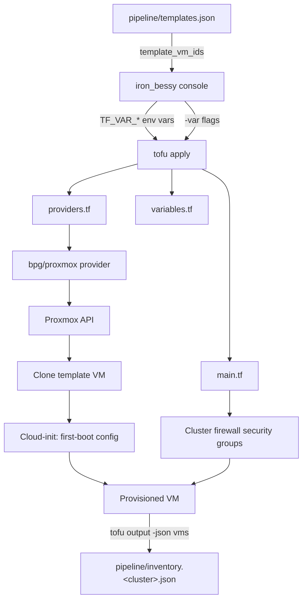

# OpenTofu Infrastructure

Provisions VMs on Proxmox by cloning Packer-built templates. Each VM type maps to a specific pipeline image; the VMID is sourced from `console/pipeline/templates.json` so there are no hard-coded IDs to maintain. Cluster-level firewall security groups are defined here and attached per-VM.

## Directory Structure

```
opentofu/
├── providers.tf    # Provider requirements and Proxmox provider config
├── variables.tf    # All input variable declarations
├── main.tf         # All resources: VMs, firewall groups, firewall rules
└── outputs.tf      # Per-VM inventory output, consumed by the console
```

VM definitions and firewall groups live in `opentofu/clusters/<cluster>/<group>.tfvars` and are loaded explicitly by the console per run.

`.terraform/`, `terraform.tfstate`, and `terraform.tfstate.d/` are gitignored. `.terraform.lock.hcl` (the provider dependency lockfile) is committed, per OpenTofu best practice, so every contributor uses the same provider versions.

State is isolated per cluster via OpenTofu workspaces (`terraform.tfstate.d/<cluster>/`). The console creates/selects the workspace matching the active cluster before every plan/apply, so applying against `home-lab` and `work` never collides.

## How It Works



The console reads `console/pipeline/templates.json` (written by Packer after each successful build) to resolve template names to VMIDs before invoking OpenTofu. After a successful apply/destroy, it writes `console/pipeline/inventory.<cluster>.json` (one file per cluster, matching the per-cluster workspace layout) for downstream tooling (Ansible, etc.). No VMID is ever hard-coded here.

## Variables

### Non-sensitive (passed via `-var` flags by the console)

| Variable | Description |
|---|---|
| `proxmox_url` | Proxmox API endpoint, e.g. `https://proxmox.example.com:8006` |
| `proxmox_node` | Node to provision VMs on |
| `proxmox_vm_storage_pool` | Storage pool for VM disks and cloud-init drives |
| `vm_network_bridge` | Network bridge for VM NICs |
| `template_vm_ids` | Map of pipeline image name to VMID, built from `templates.json` |
| `vm_default_vlan` | Cluster-scoped fallback VLAN (omitted if user skipped) |
| `vm_default_gateway` | Cluster-scoped fallback IPv4 gateway |
| `vm_default_dns_servers` | Cluster-scoped fallback DNS server list |
| `vm_default_dns_domain` | Cluster-scoped fallback DNS search domain |

### Sensitive (injected as `TF_VAR_*` environment variables by the console)

| Variable | Description |
|---|---|
| `proxmox_username` | Proxmox API token user, e.g. `terraform@pve!token-name` |
| `proxmox_token` | Proxmox API token secret |

### Per-cluster group files (`clusters/<cluster>/<group>.tfvars`)

| Variable | Description |
|---|---|
| `ubuntu_server_2404_core_vms` | Map of VMs to provision from the `ubuntu-server-2404-core` image |
| `firewall_security_groups` | Map of cluster-level security groups and their inbound/outbound rules |
| `group_deps` | Groups that must be applied before this one (console-only, not used by OpenTofu) |

## VM Types

### `ubuntu_server_2404_core_vms`

Clones from the `ubuntu-server-2404-core` pipeline image. Per-VM options:

| Field | Required | Default | Description |
|---|---|---|---|
| `cores` | yes | — | vCPU count |
| `memory` | yes | — | RAM in MB |
| `disk_size` | no | `30` | Disk size in GB |
| `vlan` | no | `vm_default_vlan` | VLAN tag for the VM NIC |
| `ip_address` | no | DHCP | Static IP with prefix, e.g. `10.0.0.10/24` |
| `ip_gateway` | no | `vm_default_gateway` | Default gateway |
| `dns_servers` | no | `vm_default_dns_servers` | List of DNS server IPs |
| `dns_domain` | no | `vm_default_dns_domain` | DNS search domain |
| `fw_security_group` | no | — | Name of a cluster firewall security group to attach |

## Adding a New VM Type

Each VM type corresponds to a specific pipeline image. The naming convention encodes the image: `ubuntu_server_2404_core_vms` clones from the `ubuntu-server-2404-core` manifest key.

1. Add a variable `<image_snake_case>_vms` in `variables.tf`, following the `ubuntu_server_2404_core_vms` pattern.
2. Add a `local.<image_snake_case>_resolved` block in `main.tf` that merges per-VM values with cluster-scoped defaults (`vm_default_vlan`, `vm_default_gateway`, `vm_default_dns_*`). Follow the `ubuntu_server_2404_core_resolved` pattern.
3. Add a `proxmox_virtual_environment_vm.<image_snake_case>_vms` resource in `main.tf` that iterates `local.<image_snake_case>_resolved`. Reference `var.template_vm_ids["<image-kebab-case>"]` to clone the correct template.
4. Add `local.<image_snake_case>_resolved` to `local.all_vms` and the new resource to `local.vm_ids` so firewall rules apply.
5. Extend `local.inventory` in `outputs.tf` with the new resource so provisioned VMs appear in `inventory.<cluster>.json`.
6. The console will automatically resolve the VMID from `templates.json` for any key present in the map.

## Pipeline Outputs

The `vms` output in `outputs.tf` emits a map of every provisioned VM keyed by name, with attributes suitable for building an Ansible inventory or other downstream tooling. After each successful apply or destroy, the console runs `tofu output -json vms`, wraps each VM with `cluster` and `applied_at` metadata, and writes the result to `console/pipeline/inventory.<cluster>.json` (one file per cluster, mirroring the per-cluster workspace layout under `terraform.tfstate.d/<cluster>/`).

Per-VM fields:

| Field | Source | Description |
|---|---|---|
| `vm_id` | bpg/proxmox | Proxmox VMID assigned at apply |
| `node` | bpg/proxmox | Node the VM is running on |
| `image` | static | Pipeline image the VM was cloned from |
| `ssh_user` | `ansible_username` | Ansible service account baked into the template by Packer |
| `ip_address` | Static config or guest agent | Static IP (CIDR stripped) or first non-loopback IP reported by QEMU guest agent |
| `vlan` | Per-VM or cluster default | Resolved VLAN tag |
| `tags` | bpg/proxmox | Proxmox tags (always includes `opentofu`) |
| `cluster` | Console | Active cluster from `credentials.conf` |
| `applied_at` | Console | UTC timestamp of the most recent apply |

Guest-agent IP resolution requires QEMU guest agent to have reported back. On a fresh apply with DHCP, `ip_address` may be `null` on the first run; re-run apply after cloud-init completes to populate it.

## Running Without the Console

Supply sensitive variables as environment variables so they stay off the command line:

```bash
export TF_VAR_proxmox_username="terraform@pve!token-name"
export TF_VAR_proxmox_token="your-token"

cd opentofu/
tofu init
tofu workspace select -or-create home-lab
tofu plan \
  -var "proxmox_url=https://proxmox.example.com:8006" \
  -var "proxmox_node=pve" \
  -var "proxmox_vm_storage_pool=local-lvm" \
  -var "vm_network_bridge=vmbr0" \
  -var 'template_vm_ids={"ubuntu-server-2404-core":991}'
```

Cluster-scoped defaults (`vm_default_vlan`, `vm_default_gateway`, `vm_default_dns_servers`, `vm_default_dns_domain`) are optional. Omit them to require the field on every VM, or pass them via `-var` to fill in gaps across all VMs in the group.

## Security Notes

- **Credentials:** `proxmox_username` and `proxmox_token` are injected via `TF_VAR_*` environment variables by the console. They are never written to the command line or any file beyond `credentials.conf`.
- **State file:** With workspaces active, state lives at `terraform.tfstate.d/<cluster>/terraform.tfstate` (one per cluster). Each contains all resource attributes including sensitive values. All `*.tfstate*` paths are gitignored. Restrict access to them as you would a credentials file.
- **TLS:** `insecure = true` in `providers.tf` accepts self-signed Proxmox certificates. Remove for production environments with valid certificates.
- **User accounts:** All pipeline accounts (ansible, break-glass) are baked into the VM template by Packer at build time. OpenTofu does not inject user accounts when cloning — it only configures the network via cloud-init.
