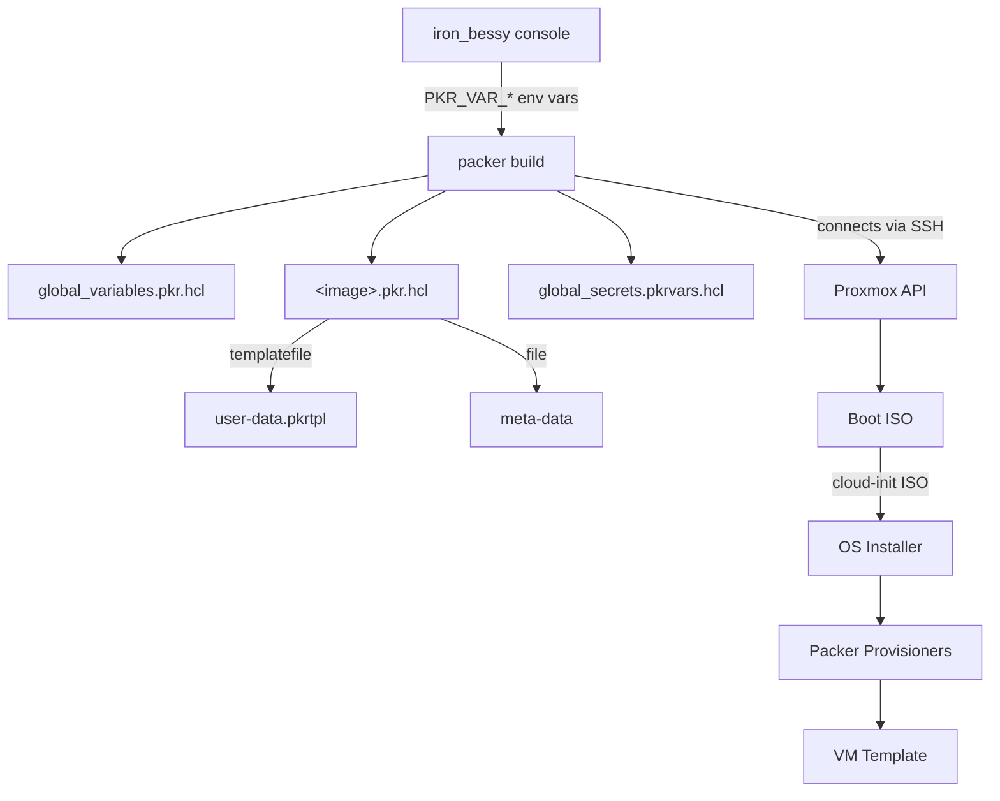

# Packer VM Templates

Packer configurations for building Proxmox VM templates. Each image is fully self-contained in its own subdirectory, which holds the `.pkr.hcl` build config, cloud-init templates, and documentation.

## Directory Structure

```
packer/
├── global_variables.pkr.hcl             # Shared variable declarations for all images
├── global_secrets.pkrvars.hcl.example          # Template for variable overrides (all images)
└── ubuntu-server-2404-core/
    ├── ubuntu-server-2404-core.pkr.hcl  # Build config
    ├── README.md                         # Image-specific documentation
    └── cloudinit/
        ├── meta-data                     # Cloud-init instance identity
        └── user-data.pkrtpl              # Cloud-init user-data template (rendered at build time)
```

## How It Works



Variables are supplied at build time by the [iron_bessy console](../console/README.md) via `PKR_VAR_*` environment variables. Secrets are never passed on the command line or written to stdout/stderr.

## Global Variables (`global_variables.pkr.hcl`)

Shared by all image configs. Values are supplied by the console.

| Variable | Description |
|---|---|
| `proxmox_url` | Proxmox API endpoint, e.g. `https://proxmox.example.com:8006` |
| `proxmox_node` | Node to build on |
| `proxmox_username` | API token user, e.g. `packer@pve!token-name` |
| `proxmox_token` | API token secret (sensitive) |
| `proxmox_vm_storage_pool` | Storage pool for VM disks |
| `proxmox_iso_storage_pool` | Storage pool for ISOs |
| `proxmox_vm_pool` | Proxmox resource pool (empty string = no pool) |
| `vm_network_bridge` | Network bridge, e.g. `vmbr0` |
| `vm_network_vlan` | VLAN tag (1-4094) |
| `template_username` | SSH username Packer creates and uses during the build (sensitive) |
| `template_password` | SSH password for the build user (sensitive) |
| `ansible_username` | Ansible service account username baked into the template |
| `ansible_ssh_key` | SSH public key for the ansible account (sensitive) |
| `breakglass_username` | Break-glass account username baked into the template |
| `breakglass_ssh_key` | SSH public key for the break-glass account (sensitive) |

## Secrets

All secrets are stored in `console/credentials.conf` (gitignored) and injected as `PKR_VAR_*` environment variables by the console. Nothing sensitive touches the command line or Packer output.

**Hypervisor credentials** (`proxmox_username`, `proxmox_token`) live under the cluster section, e.g. `[tmm01]`, and are loaded by `proxmox_load_credentials`.

**Pipeline account credentials** (`template_username`, `template_password`, `ansible_username`, `ansible_ssh_key`, `breakglass_username`, `breakglass_ssh_key`) live under the `[sys:packer]` section in `console/credentials.conf`and are loaded by `_packer_load_image_credentials`. Example:

```ini
[sys:packer]
template_username   = build
template_password   = your-strong-password
ansible_username    = ansible
ansible_ssh_key     = ssh-ed25519 AAAA... ansible@example
breakglass_username = breakglass
breakglass_ssh_key  = ssh-ed25519 AAAA... breakglass@example
```

Sections prefixed `sys:` are reserved for console-internal configuration and never appear in the cluster selection menu.

**Variable overrides** (e.g. a different VMID or ISO path) go in `packer/global_secrets.pkrvars.hcl` alongside the example stubs. Since all images share this file, variable names must be unique across all images (each image declares its own names in its `.pkr.hcl`).

## Images

| Image | Description |
|---|---|
| [ubuntu-server-2404-core](ubuntu-server-2404-core/README.md) | Minimal Ubuntu 24.04 LTS server template for OpenTofu cloning |

## Adding a New Image

1. Create the image directory and place the build config inside it:
   ```
   packer/<image-name>/
   ├── <image-name>.pkr.hcl   # build config; declare only image-specific variables
   ├── README.md
   └── cloudinit/              # if the OS supports cloud-init
       ├── meta-data
       └── user-data.pkrtpl
   ```
2. Image-specific variables (VMID, ISO path, etc.) go in `<image-name>.pkr.hcl`. Global variables (Proxmox connection, pipeline accounts) are declared in `global_variables.pkr.hcl`. Default override stubs go in `packer/global_secrets.pkrvars.hcl.example`.
3. Add a symlink so the image directory sees the shared variable declarations: the console creates `global_variables.pkr.hcl -> ../global_variables.pkr.hcl` inside the image directory automatically on first build.
4. The console detects new images automatically at next run.
