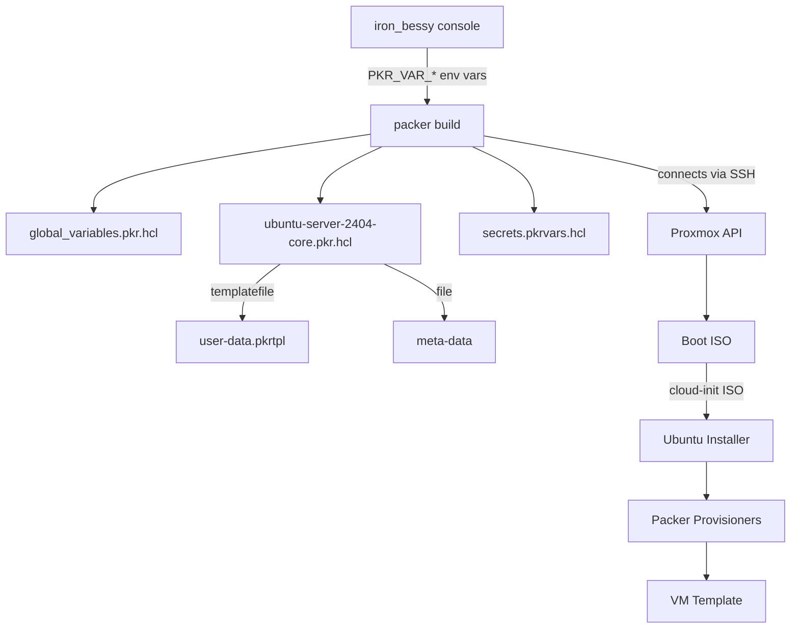
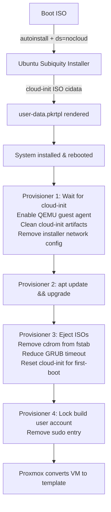

# Packer VM Templates

Packer configurations for building Proxmox VM templates. Each image is defined by a single `.pkr.hcl` file in this directory and an image-specific subdirectory for cloud-init and secrets.

## Directory Structure

```
packer/
├── global_variables.pkr.hcl          # Shared variable declarations for all images
├── ubuntu-server-2404-core.pkr.hcl   # Ubuntu 24.04 Server build config
└── ubuntu-server-2404-core/
    ├── cloudinit/
    │   ├── meta-data                  # Cloud-init instance identity
    │   └── user-data.pkrtpl           # Cloud-init user-data template (rendered at build time)
    └── secrets.pkrvars.hcl.example   # Template for image credentials
```

## How It Works



Variables are supplied at build time by the [iron_bessy console](../console/README.md) via `PKR_VAR_*` environment variables. No variables are passed on the command line (credentials stay out of the process list).

## Variables

### Global (`global_variables.pkr.hcl`)

These variables are shared by all image configs. Their values are supplied by the console wrapper.

| Variable | Description |
|---|---|
| `proxmox_url` | Proxmox API endpoint, e.g. `https://proxmox.example.com:8006` |
| `proxmox_node` | Node to build on |
| `proxmox_username` | API token user, e.g. `packer@pve!token-name` |
| `proxmox_token` | API token secret (sensitive) |
| `proxmox_vm_storage_pool` | Storage pool for VM disks |
| `proxmox_iso_storage_pool` | Storage pool for ISOs |
| `proxmox_vm_pool` | Proxmox resource pool (empty string = no pool) |
| `vm_network_bridge` | Network bridge, e.g. `vmbr0` |
| `vm_network_vlan` | VLAN tag (1–4094) |
| `template_username` | SSH username Packer will create and use |
| `template_password` | SSH password for that user (sensitive) |

### Image-Specific (`ubuntu-server-2404-core.pkr.hcl`)

| Variable | Default | Description |
|---|---|---|
| `vm_id` | `991` | Proxmox VMID for the template. Must be unique. |
| `vm_boot_iso` | `local:iso/ubuntu-24.04.4-live-server-amd64.iso` | ISO volid on Proxmox storage |
| `vm_boot_iso_hash` | `sha256:e907...` | SHA256 checksum for ISO integrity verification |

## Images

### `ubuntu-server-2404-core`

A minimal Ubuntu 24.04 LTS server template suitable for use as a Terraform/OpenTofu clone base. "Core" is not an official Ubuntu SKU — it's used here to distinguish the headless build from any future desktop variant.

**Template VM specs:**

| Setting | Value |
|---|---|
| VM ID | 991 |
| VM Name | `template-ubuntu-2404-server-core` |
| OS | Ubuntu 24.04 LTS Server |
| CPU | 2 cores, x86-64-v2-AES |
| Memory | 2048 MB |
| Disk | 30 GB virtio, raw format |
| Firmware | OVMF (UEFI) with 4M EFI partition |
| Network | virtio, bridge + VLAN tag configured at build time |
| Guest Agent | QEMU guest agent enabled |

**Build stages:**



**Cloud-init (`user-data.pkrtpl`):**

The installer runs fully unattended via the NoCloud datasource. The template is rendered by Packer at build time, substituting `${username}` and `${password_hash}` (bcrypt). Key configuration:

- Locale: `en_US`, keyboard `us`, timezone `UTC`
- Packages installed: `auditd`, `sudo`, `qemu-guest-agent`, `openssh-server`, `cloud-init`, `python3`, `python3-pip`, `curl`
- Password authentication enabled for SSH
- Passwordless sudo granted via `sudoers.d`
- No swap
- IPv4 DHCP only

After the build, the cloud-init state is cleaned (`cloud-init clean --logs`) so the template behaves as a fresh first-boot when cloned.

**Why the build user is locked, not deleted:**
The build-time user account cannot be deleted while Packer is connected as that user. It is locked and stripped of sudo instead. Downstream provisioning (e.g., Terraform + cloud-init on clone) is responsible for removing it.

## Secrets

There are 2 main secrets:

1. Hypervisor secrets
1. VM Secrets

Hypervisor secrets are stored in `/console/.credentials` (gitignored) and are handled entirely by the console wrapper. VM secrets are stored in the image-specific `secrets.pkrvars.hcl` file (gitignored), which holds the credentials used to provision the image (e.g. `template_username`, `template_password`). It is required for any image that declares these variables — which includes the default Ubuntu image — and is strictly optional only for images that don't.

The console wrapper automatically passes this file to Packer via `-var-file` if it exists. Proxmox credentials (`proxmox_username`, `proxmox_token`) are never written to disk — they are injected as `PKR_VAR_*` environment variables by the console.

## Adding a New Image

1. Create `packer/<image-name>.pkr.hcl`. Declare only image-specific variables (VMID, ISO path, etc.).
2. Create `packer/<image-name>/` for cloud-init and secrets:
   ```
   packer/<image-name>/
   ├── cloudinit/
   │   ├── meta-data
   │   └── user-data.pkrtpl
   └── secrets.pkrvars.hcl.example
   ```
3. The console will automatically detect the new image at next run.

## Running Without the Console

You can invoke Packer directly for debugging, but you must supply all variables manually:

```bash
cd packer/

export PKR_VAR_proxmox_username="packer@pve!token-name"
export PKR_VAR_proxmox_token="your-token"

# First run only — fetches required plugins.
packer init .

packer validate \
  -var "proxmox_url=https://proxmox.example.com:8006" \
  -var "proxmox_node=pve" \
  -var "proxmox_vm_storage_pool=local-lvm" \
  -var "proxmox_iso_storage_pool=local" \
  -var "proxmox_vm_pool=" \
  -var "vm_network_bridge=vmbr0" \
  -var "vm_network_vlan=100" \
  -var-file="ubuntu-server-2404-core/secrets.pkrvars.hcl" \
  --only="*.proxmox-iso.ubuntu-2404-core" \
  .
```

## Performance & Resource Requirements

**Build Time:** ~10–15 minutes per template (depends on network and Proxmox performance).

**Storage:** Each build requires:
- 30 GB disk space for VM + cloud-init ISOs (configurable in `disks.disk_size`)
- Additional space in ISO storage for Ubuntu ISO

**Memory:** 2 GB assigned to build VM during build (set in `memory`).

**Network:** Build VM requires:
- Internet access for `apt-get update` and package installation
- Connectivity to Packer host (SSH, typically localhost via Proxmox)

## TLS and Security

**Current (Homelab):**
- `insecure_skip_tls_verify = true` in the source block
- Self-signed certificates are accepted without validation

**Production Deployment:**
1. Obtain proper CA-signed certificates for Proxmox
2. Set `insecure_skip_tls_verify = false` in the source block
3. Optionally, use `ca_file` to specify a CA bundle if needed
4. Test certificate validation before full automation

## Build User Account Management

The build user (default: `packer`) is **locked but not deleted** after the build completes:

- **Why:** Packer cannot delete the account it's currently connected as (SSH session limitation)
- **State after build:** Account exists but `passwd -l` locks it; sudo privileges removed
- **Your responsibility:** Downstream provisioning (e.g., Terraform + cloud-init on clone) should remove it
- **Cleanup example:** `userdel -r packer` after verifying no build processes use it

> **TLS:** Proxmox uses self-signed certificates by default. `insecure_skip_tls_verify = true` is set in the source block. This is intentional for homelab environments, but should be removed in production with proper certificate validation.