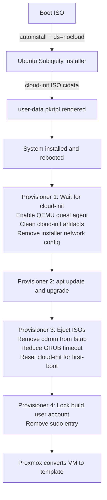

# ubuntu-server-2404-core

A minimal Ubuntu 24.04 LTS server template for use as an OpenTofu clone base. "Core" is not an official Ubuntu SKU — it distinguishes this headless server build from any future desktop variant.

## Template VM Specs

| Setting | Value |
|---|---|
| VM ID | 991 |
| VM Name | `template-ubuntu-2404-server-core` |
| OS | Ubuntu 24.04 LTS Server |
| CPU | 2 cores, x86-64-v2-AES |
| Memory | 2048 MB |
| Disk | 30 GB virtio, raw format |
| Firmware | OVMF (UEFI) with 4M EFI partition |
| Network | virtio, bridge + VLAN tag configured at build time |
| Guest Agent | QEMU guest agent enabled |

## Image Variables

Declared in `ubuntu-server-2404-core.pkr.hcl`. All other variables are global (see [../README.md](../README.md)).

| Variable | Default | Description |
|---|---|---|
| `vm_id` | `991` | Proxmox VMID for the template. Must be unique cluster-wide. |
| `vm_boot_iso` | `local:iso/ubuntu-24.04.4-live-server-amd64.iso` | ISO volid on Proxmox storage |
| `vm_boot_iso_hash` | `sha256:e907...` | SHA256 checksum for ISO integrity verification |

## Build Stages



## Cloud-init (`user-data.pkrtpl`)

The installer runs fully unattended via the NoCloud datasource. The template is rendered by Packer at build time, substituting `${username}` and `${password_hash}` (bcrypt). Key configuration:

- Locale: `en_US`, keyboard `us`, timezone `UTC`
- Packages installed: `auditd`, `sudo`, `qemu-guest-agent`, `openssh-server`, `cloud-init`, `python3`, `python3-pip`, `curl`
- Password authentication enabled for SSH
- Passwordless sudo granted via `sudoers.d`
- No swap
- IPv4 DHCP only

After the build, cloud-init state is cleaned (`cloud-init clean --logs`) so the template behaves as a fresh first-boot when cloned.

## Secrets

VM secrets are stored in `global_secrets.pkrvars.hcl` (gitignored). Copy from the example and set the credentials Packer will use during the build:

```bash
cp global_secrets.pkrvars.hcl.example global_secrets.pkrvars.hcl
# Edit: set template_username and template_password
```

The console passes this file to Packer automatically via `-var-file` if it exists. Proxmox credentials are never in this file — they are injected as `PKR_VAR_*` environment variables by the console.

**Why the build user is locked, not deleted:** The build-time account cannot be deleted while Packer is connected as that user. It is locked and stripped of sudo instead. Ansible is responsible for removing it after a VM is deployed.

## Performance

**Build time:** ~10-15 minutes (depends on network and Proxmox performance).

**Storage per build:**
- 30 GB for the VM disk (configurable via `disk_size`)
- ISO storage for the Ubuntu ISO

**Memory:** 2 GB assigned to the build VM during the build.

**Network:** The build VM needs internet access for `apt-get update` and package installation, plus SSH connectivity back to the Packer host.

## Running Without the Console

You can invoke Packer directly for debugging, but all variables must be supplied manually:

```bash
# Run from the image directory — packer is pointed at . which contains
# ubuntu-server-2404-core.pkr.hcl and a symlink to global_variables.pkr.hcl.
cd packer/ubuntu-server-2404-core/

export PKR_VAR_proxmox_username="packer@pve!token-name"
export PKR_VAR_proxmox_token="your-token"

# First run only — fetches required plugins.
packer init .

packer validate \
  -var "proxmox_url=https://proxmox.example.com:8006" \
  -var "proxmox_node=pve" \
  -var "proxmox_vm_storage_pool=local-lvm" \
  -var "proxmox_iso_storage_pool=local" \
  -var "proxmox_vm_pool=" \
  -var "vm_network_bridge=vmbr0" \
  -var "vm_network_vlan=100" \
  -var-file="../global_secrets.pkrvars.hcl" \
  --only="*.proxmox-iso.ubuntu-2404-core" \
  .

packer build \
  -var "proxmox_url=https://proxmox.example.com:8006" \
  -var "proxmox_node=pve" \
  -var "proxmox_vm_storage_pool=local-lvm" \
  -var "proxmox_iso_storage_pool=local" \
  -var "proxmox_vm_pool=" \
  -var "vm_network_bridge=vmbr0" \
  -var "vm_network_vlan=100" \
  -var-file="../global_secrets.pkrvars.hcl" \
  --only="*.proxmox-iso.ubuntu-2404-core" \
  .
```
